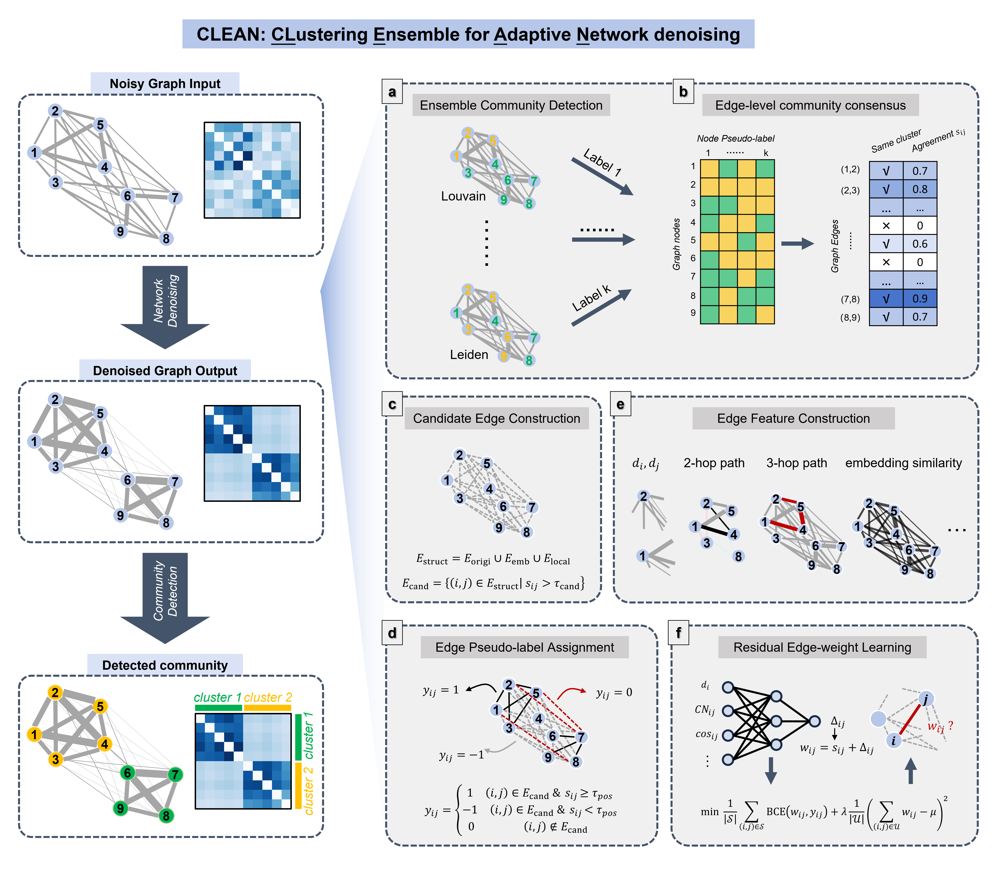

# CLEAN: Community-Aware Network Denoising

CLEAN (**Cl**ustering **E**nsemble for **A**daptive **N**etwork denoising) is a consensus-guided residual learning framework for denoising networks before community detection. It is designed for graphs whose observed edges are noisy, incomplete, or contaminated by inter-community connections that obscure mesoscale structure.

Instead of treating network denoising as a generic link-prediction or diffusion problem, CLEAN defines signal and noise with respect to community detection: useful edges are those that support stable intra-community structure, while noisy edges are those that blur community boundaries.

## Method Overview

CLEAN follows six main steps:

1. Build an ensemble of community partitions from the observed graph.
2. Convert the ensemble into edge-level consensus scores.
3. Construct a candidate edge set from observed edges, node2vec-based neighbors, and local structural neighbors.
4. Assign pseudo-labels using consensus thresholds.
5. Extract multi-scale edge features, including local, high-order, and embedding-based similarities.
6. Train a residual EdgeNet model that refines the consensus score into a denoised edge weight.

The final output is a sparse weighted adjacency matrix whose edges are more aligned with the latent community structure.

<p align="center">
  <a href="https://github.com/jiatingyu-amss/CLEAN/">
    
  </a>
</p>

## Installation

The code uses both Python and R. Python is used for graph processing, feature construction, learning, and evaluation. R/igraph is used for several community detection algorithms.

### Python dependencies

```bash
pip install numpy scipy pandas scikit-learn torch networkx node2vec matplotlib seaborn
```

### R dependencies

Install R and the `igraph` package:

```r
install.packages("igraph")
```

## Input Data Format

For the example scripts, each dataset is expected as a NumPy archive:

```text
Data/<dataset>/network_with_label.npz
```

with two arrays:

```python
Network  # shape (N, N), adjacency matrix
label    # shape (N,), ground-truth community labels
```

The adjacency matrix should be square and undirected. The code symmetrizes several intermediate matrices for safety, but providing a clean symmetric input is recommended.

## Reproducing Experiments

### Synthetic SBM example

```bash
python S1_test_sbm.py
```

This script generates a stochastic block model, adds noise, runs CLEAN, and saves visualizations and metrics under `Results/sbm/`.

### Karate Club example

```bash
python S2_test_karate.py
```

This runs CLEAN on Zachary's Karate Club network and evaluates downstream community detection performance.

### Benchmark against baselines

```bash
python S3_benchmarking.py
```

This compares CLEAN with representative denoising and similarity methods:

- Noisy graph
- Katz
- Network Enhancement (NE)
- Common Neighbors (CN)
- Local Path (LP)
- Network Refinement (NR)
- CLEAN

<!-- ## Citation

If you use CLEAN in your work, please cite:

```bibtex
@article{yu2026clean,
  title   = {Consensus-Guided Residual Correction for Community-Aware Network Denoising},
  author  = {Yu, Jiating and Gan, Xiao and Sun, Duanchen and Wu, Ling-Yun},
  journal = {Manuscript in preparation},
  year    = {2026}
}
``` -->
